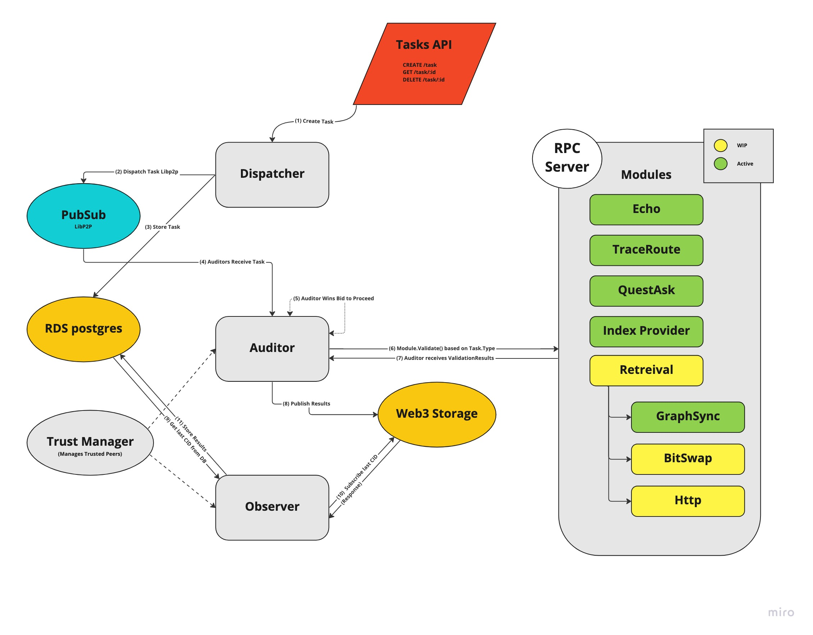

# Validation Bot

This repo contains the validation bot that is used to collect metrics to determine a base meassurement for quality of miners on the Filecoin network.

# Current Project Status

This project is running in production and is in active development.

# Validation Bot CLI commands

#### generate new peer ID

generates a new peerID, public key, and private key. This can be used for generating keys for the `conig.yml` file.

```./validation_bot generate-peer```

#### modify trusted peers

create/revoke/reset trusted peers and publish to the network via W3Sname.

```./valiation_bot modify-trusted-peer --type <string> -k <string> -t <string> -p <string>```

##### Options
```bash
  --type <string> (required)
    create/revoke/reset trusted peer
  -k, --trustor-key <string> (required)
    private key of the trustor
  -t, --w3s-token <string> (required)
    token for web3.storage
  -p, --peer <string> (required)
    trustee peerID(s) string to operate on
```

#### list-trusted-peers

list all published trusted peers.
```./validation_bot list-trusted-peers --p <string>```

##### Options

```bash
  --peerid, -p <string> (required)
    peerIDStr of the trustor
```
# Running the Validation Bot

1. clone the repo down:

```git clone git@github.com:data-preservation-programs/ValidationBot.git```

2. run the make file, this will output the validation_bot binary:

```make all```

3. copy the config template to a config file:

```cp config.template.yaml config.yaml```

**the app sets a default config in `bootstrap.go` if no config.yaml**

4. Set Environment Variables

once the validation_bot binary is built, you can generate two private keys:

```bash
> ./validation_bot generate-peer

New peer generated using ed25519, keys are encoded in base64
peer id:      abcdKooWASD9sAWe4rrmEzBD6aN6DSg3vxpHopgfrau3WMMM37vd
public key:   DACSIAkutzW3LbmaZea/Bq9uuAfNWjf+MZth4372VJntzaiO
private key:  DACSQKKAZysMKUnt3RIWP3o0fR8MDfqvR/fhF0e7Jhq3qs1dCS63NbctuZpl5r8Gr264B81aN/4xm2HjfvZUme3NqI4=

> export DISPATCHER_PRIVATEKEY=DACSQKKAZysMKUnt3RIWP3o0fR8MDfqvR/fhF0e7Jhq3qs1dCS63NbctuZpl5r8Gr264B81aN/4xm2HjfvZUme3NqI4=

etc...
```

environment variables are listed below:

```bash
export DISPATCHER_PRIVATEKEY="" # get with generate-peer cli command
export AUDITOR_PRIVATEKEY=""    # get with generate-peer cli command
export IPINFO_TOKEN=""          # ipinfo token - https://ipinfo.io/
export W3S_TOKEN=""             # Web3Storage token - https://web3.storage/
```

5. start the validation bot binary:

```./validation_bot```

# Design

## Architecture

<p align="center">
  
</p>

[miro board](https://miro.com/app/board/uXjVP2sy1Nk=/?moveToViewport=-1582,-828,2605,2080&embedId=755140909102)

## Dispatcher

The dispatcher is responsible for querying the RDS database for all tasks that are ready to be processed and broadcasting them through the pubsub channel (via libp2p) to be consumed by the [Auditors](##Auditor) network. It also receives one off tasks from the [tasks API](#Tasks-API) and runs the Auditor module on the recieved task.

## Auditor

The Auditor is responsible for running **validation modules** on the various tasks that it recieves, publishing the **validation results** to Web3Storage. A module's purpose is to test different aspects of a storage provider. These modules include:

* Echo - returns the task input to test its received.
* Trace Route - tests approximate geolocation of miner.
* QueryAsk - queries **marketplace** (via libp2p) for miner details like Price, PieceSize, etc.
* Index Provider - query [index provider](https://github.com/ipni/storetheindex) for root CID of miner.
* Retrieval - creating a timeline of events around stats such as time to first byte (TTFB), bytes downloaded, average speed per sec, time elapsed, etc.
  * GraphSync - fetches a random CID from the target miner over [GraphSync](https://github.com/ipld/specs/blob/master/block-layer/graphsync/graphsync.md)
  * Bitswap - fetches a random CID from the target miner over [Bitswap](https://github.com/ipfs/specs/blob/main/BITSWAP.md)
  * Http - fetches a random CID from the target miner over [Http](https://docs.ipfs.tech/reference/http/gateway/)

## Trust Manager

The trust manager connects the Auditor and Observer, sharing "trusted peers" so that the Observers and Auditors can coordinate against the Database and Web3Storage to resolve difference between a miners database CID and the miner's Web3Storage Root CID.

## Observer

The Observer subscribes to Web3Storage and pushes data from the **validation results** back to the **RDS database**. It does this one CID at a time starting with the **last CID seen in the RDS database**, comparing that to the **latest CID recieved by querying the ipns for the miner**. The observer will then iterate the difference between last seen CID to the latest Root CID, downloading all entries in between and syncing them to the RDS database.

# Tasks API

The response values will error is unsuccesful and return `nil` when successful. The routes for create, deleting, and listing tasks for a `Dispatcher` are as follows:

```
DELETE /task/:id => error
POST /task Definition => error
GET /tasks => (Definition[], error)
```

The `CREATE` route takes a body with a task `Definition`.

```
struct Definition {
  ID              DefinitionID
  Target          string
  Type            Type
  IntervalSeconds uint32
  Definition      pgtype.JSONB
  Tag             string
}
```
